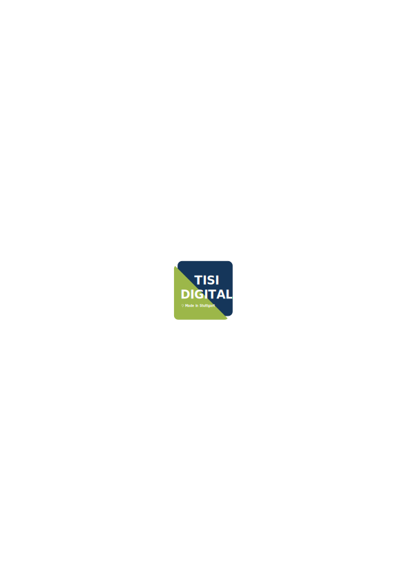

# extendedArticle
Dieses Bundle erweitert die Contao Artikel-Einstellungen um Funktionen für Hero-Header. Es lassen sich Hintergrundbilder definieren und mit farbigen Overlays versehen. Außerdem ist eine Parallax-Funktion integriert und es lassen sich Bildschirmhohe Hero-Header einstellen.
Außerdem können Vektorformen als Divider definiert werden.